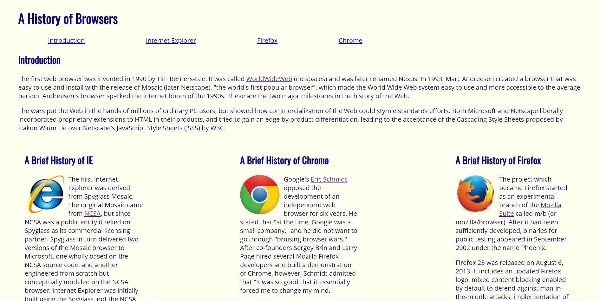
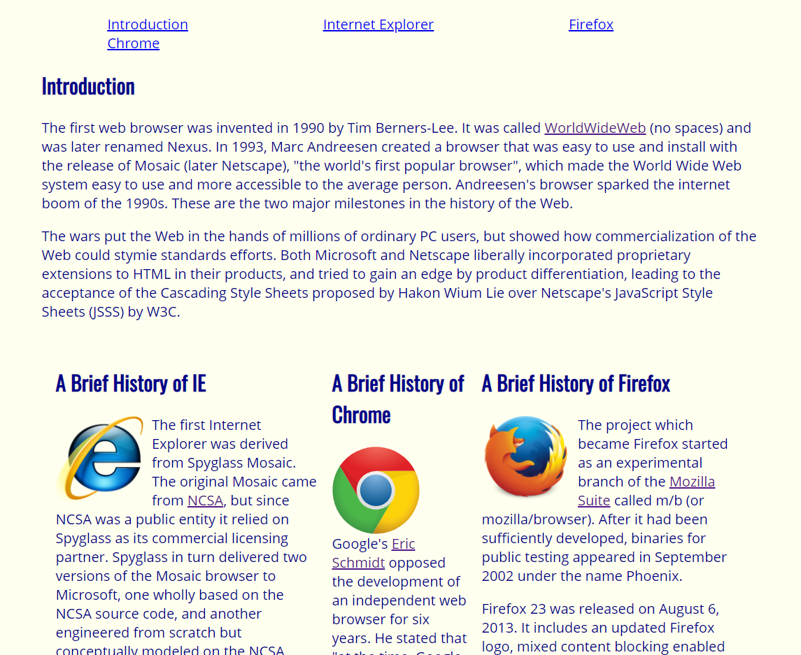
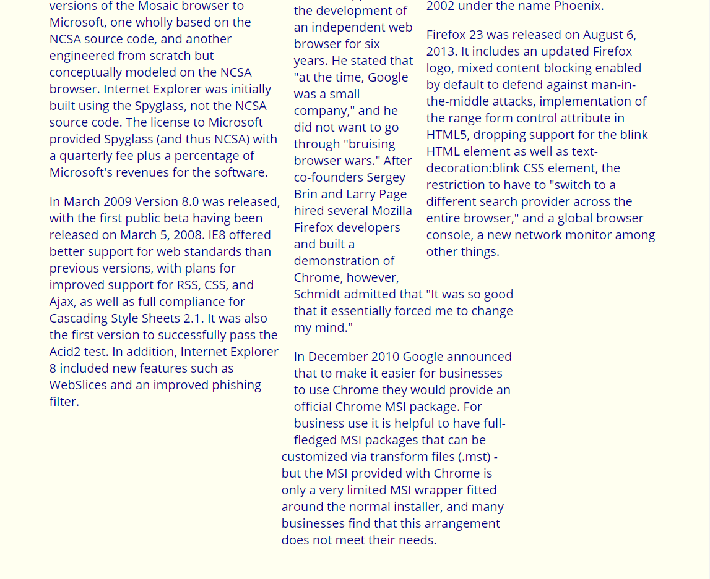
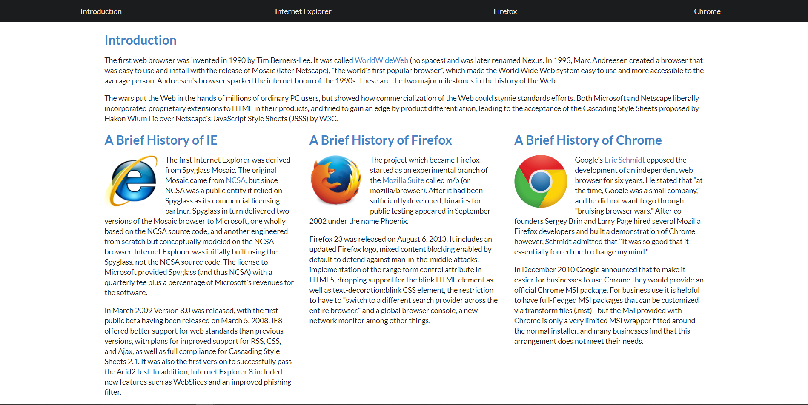

During the first week of learning the basics of UI design (HTML5 and CSS) in ICS 314, one of my assignments was to create a simple webpage that displayed a short history of browsers. The assignment was given in multiple parts, and the purpose was to become familiar with HTML, CSS, and how they work together. The last component of this assignment was to arrange some information into 3 equal width columns, each 300px wide. 

I did this by floating one section 300px wide to the left, floating one section 300px wide to the right, and adding a padding of 300px on the left and right of the middle section. It worked and it looked nice, but I quickly learned that if I changed the browser width, the columns don’t remain the same. When I decreased the width of the browser window, the columns on the right remain the same width but the center column collapses to a point where it's unreadable.

This bothered me so I searched for ways to fix it, and that’s when I read about responsive web design. The following week, we started learning about UI frameworks, specifically Semantic UI. Lo and behold, this framework was the answer to my problems with columns! Although Semantic UI has a bit of a high learning curve, the time invested was well worth it. As a responsive UI framework, the design and development of a webpage responds to different behaviors, screen sizes, and platforms. This allows for beautiful webpages to maintain its aesthetics no matter the browser type or screen size. This is one of the most important features of UI frameworks because information and design should be displayed to users of all platforms and devices in an attractive fashion. Without a framework like Semantic UI, multiple HTML and CSS files are needed to be programmed to suit specific screen sizes, host devices, browser platforms, etc.

I quickly fell in love with so many features Semantic UI had to offer. Containers and grids are the most convenient ways to organize elements, and grids became my favorite component of Semantic UI thus far. Using Semantic UI to create the same ‘browser history’ webpage with columns was so much easier and visually more appealing. I implemented a menu for the navigation bar and a grid container to create the three columns. 
[PIC]

I’m going to be honest, learning and understanding even the basics of Semantic UI was a pain and took a while for me to get the hang of, but I never thought I would be able to recreate the looks of actual professionally made websites in less than a week’s time. Semantic-ui.com is a great aid in understanding and learning the framework, and provides example codes for whatever it is you’re looking to do.
