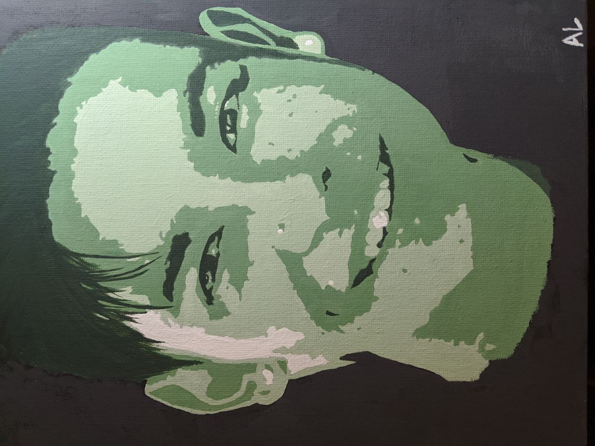

I created this portrait (8x10 acrylic on canvas) as a gift and a personal project in 2019. I’m not an avid painter but I enjoy the process because it clears my mind and I love the headspace I’m in when I draw, paint, or do any sorts of arts and crafts. Through the process of painting, I learn to be more patient, more attentive to detail, and most importantly, push the bounds of creativity. This painting took me a little over a month to complete by squeezing in a couple hours each week, between homework assignments and studying. It really helped me de-stress and I find that being able to accommodate solitary activities into a busy schedule is vital for mental health. 

