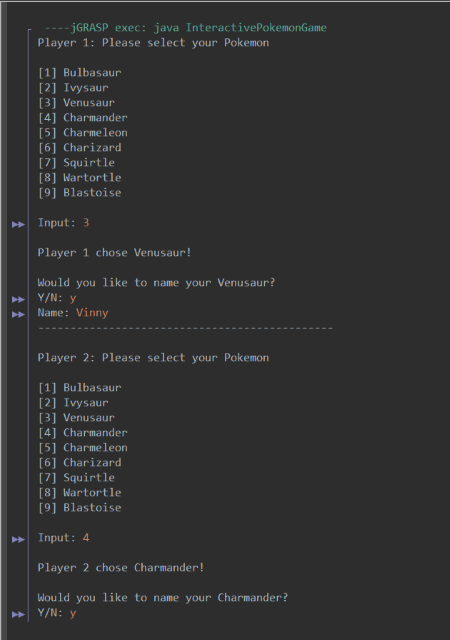
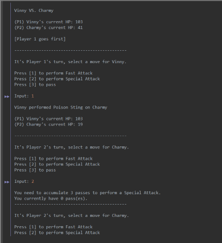
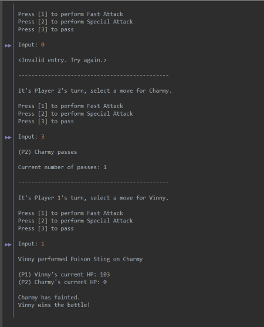

  
  
  

Pokemon Battle is a simple two-player game, written in Java, for ICS 211. It utilizes object classes and interfaces. The types (water, fire, poison, etc.) of each species are stored in interfaces, which includes their type and power of attacks. Each individual Pokemon is constructed in a class that implements its corresponding type interface, and inherits an abstract parent class. 

  

The game allows two players to alternate turns on the same computer. A menu will appear for the first player to select a Pokemon species to battle with and an option to name their Pokemon. After selection and naming, the same menu will appear for player two. Each player’s HP is displayed before battle begins, and a random generator decides which player goes first. HP is determined randomly according to Pokemon type. A player has three options for each turn: perform Fast Attack, perform Special Attack, and pass. Three passes must be accumulated in order to perform one Special Attack but a Fast Attack can be performed at any time. It will display specific attack performed, such as Poison Sting, how effective it was on opponent, each player’s current HP, and current number of passes after each turn. If a player uses a Special Attack before accumulating enough passes, it will alert the player and allow them to choose another option. Attacks decrement opponent’s HP level by an amount dependent on effectiveness of attack type. A Pokemon terminates when HP reaches zero, and announces the winner of the battle.

