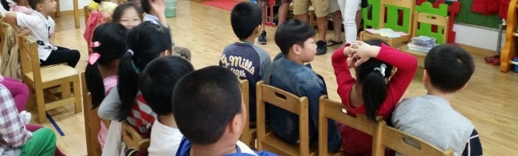

In Fall of 2016, I had the opportunity to study abroad in Shanghai through the Freeman China Scholarship program. I attended East China Normal University and my classes consisted of Chinese language, history, and culture. Part of the program required us to teach English to Chinese kindergarten students once a week, so my colleagues and I created lesson plans each week.
It was my first time working with children and co-leading a class, and the experience was invaluable. It showed me the stark contrasts in American and Chinese educational systems, and how rewarding it is to teach. 

Most schools in China integrate English language into their curriculum as early as Kindergarten, so most of our students were already familiar with the English alphabet and basic phrases but couldn’t yet visually recognize all individual letters alone. For the first couple of weeks, we focused on writing, recognizing, and associating letters with words that begin with those letters. We moved on to learning names of body parts, animals, emotion words, verbs, foods, etc. by repeating them in Mandarin and then English. For each lesson, which was one hour each week, we focused on one of those subjects and planned activities and games to aid their learning in a more exciting way. 

We were able to sit in on some of their classes before and after our scheduled lessons, and I found that learning in China is heavily focused on memorization, repetition, and reciting. Classrooms are relatively quiet as strict rules are enforced; thus, children are very well-behaved and attentive. As a result, it was a bit challenging to get students to open up and become comfortable enough to participate in our activities at first. However, within a few weeks, they were always excited to engage in activities, games, and conversations. 

The goal was to teach them English but it was also an opportunity to exercise and refine my Mandarin. The experience was gratifying and taught me that although American and Chinese learning styles differ, children are very adaptable and absorb information quickly. My hopes are that they learned more than just English via this experience and that they have more opportunities to acquaint themselves with other different cultures.
